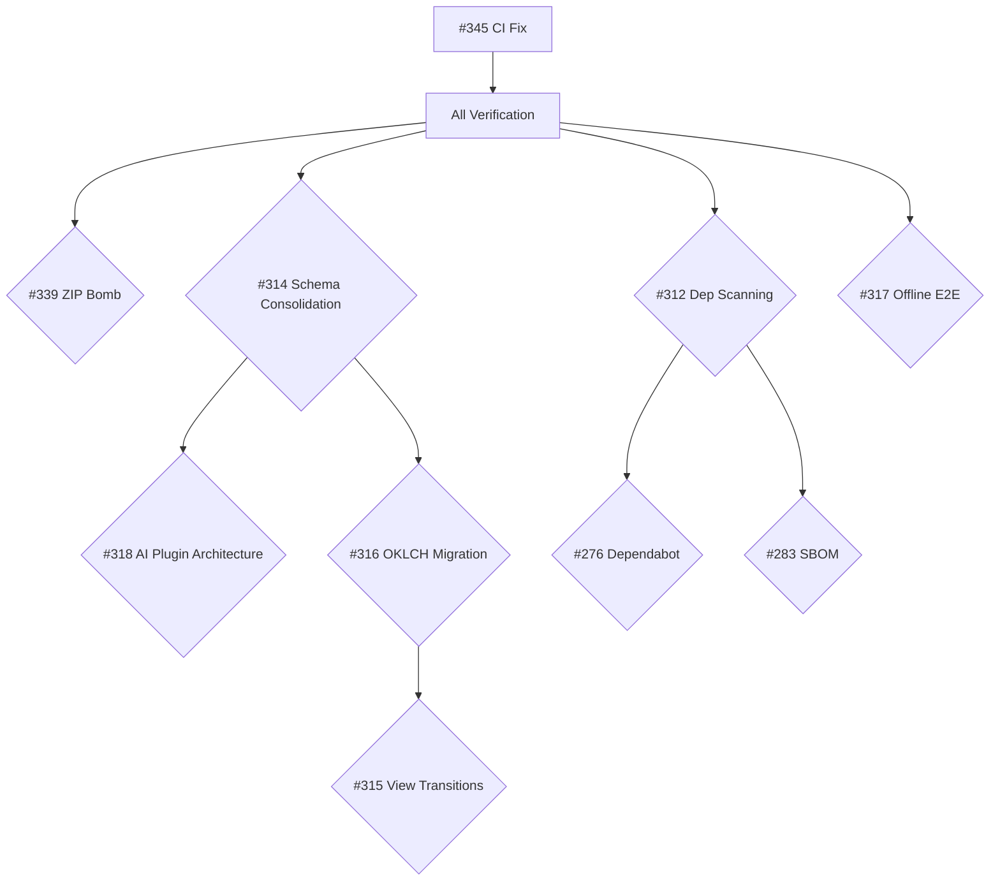

# GOAP Plan 025 – Orchestrate All Open Issues

## ANALYZE – Codebase State

### Repository Structure
- **Monorepo**: apps/ (web, worker, tests), packages/ (reader-core, schema, shared, testkit, ui)
- **Stack**: React 19 + Vite 8 + Tailwind 4 + Zustand 5 (FE), Cloudflare Workers + Turso + R2 (BE)
- **Testing**: Vitest 4 + Playwright 1.59+
- **Tooling**: Turborepo 2.9 + pnpm 10
- **Latest Release**: v0.1.0 (May 17, 2026)
- **CI Status**: FAILING (#345)

### Current Phase (from plans/007-implementation-phases.md)
- Phase 4 (Editorial Toolkit) and Phase 5 (Admin Console) completed
- Next: Phase 6+ (AI-assisted workflows, optimization, hardening)

### Open Issues Summary
| Category | Count | Priority |
|----------|-------|----------|
| Security/Vulnerability | 3 | CRITICAL-HIGH |
| Architecture/Refactoring | 4 | HIGH |
| UI/UX Features | 3 | MEDIUM |
| Testing/QA | 2 | MEDIUM |
| CI/CD/Infrastructure | 3 | CRITICAL-HIGH |
| Documentation/Meta | 5 | LOW |

## DECOMPOSE – Issue Breakdown

### BLOCK 1: CI Recovery (BLOCKING)
- **#345**: CI failure on main – investigate and fix GitHub Actions workflow
  - **Fix**: TypeScript error `validation` → `validationResults` in `books.ts:110`
  - **ESLint upgrade**: `@typescript-eslint/require-await` promoted from `warn` → `error`;
    fixed 43 violations across worker and web packages

### BLOCK 2: Security Hardening (PARALLEL with BLOCK 1)
- **#339**: [CRITICAL] ZIP Bomb and Archive Traversal in EPUB parsing
  - Re-implemented `archive-validator.ts` using `fflate` (was removed in PR #325)
  - Limits: 100MB compressed, 1GB uncompressed, 10k entries, 10:1 compression ratio
  - Path traversal protection (`..`, absolute paths, backslash)
  - Integrated into `epub-loader.ts` load method (fetch → validate → load)
  - Tests: 6 test cases covering valid, oversized, path traversal, ZIP bomb, corrupt archives
- **#312**: Dependency vulnerability scanning in CI pipeline
  - Added `pnpm audit --audit-level=high` as `dep-scan` CI job
  - Added SBOM generation to every CI build (was only in release)
  - Dependabot config, auto-merge, Scorecard were already in place
- **#276**: Dependabot configuration (related to #312)

### BLOCK 3: Architecture Consolidation (AFTER BLOCK 1)
- **#314**: Consolidate schemas into schema package, remove duplicate locator
- **#318**: Design AI-assisted features plugin architecture
- **#311**: [to be analyzed]

### BLOCK 4: UI/UX Modernization (PARALLEL with BLOCK 3)
- **#316**: Migrate to OKLCH color system
- **#315**: Implement View Transitions API for page navigation

### BLOCK 5: Testing & QA (ANYTIME)
- **#317**: Add offline functionality E2E tests
- **#310**: [to be analyzed]

## STRATEGIZE – Execution Order

1. **Immediate**: Fix #345 (CI) → unblocks all verification
2. **Parallel Sprint A**: #339 (ZIP bomb) + #312 (dep scanning)
3. **Parallel Sprint B**: #314 (schema consolidation) + #316 (OKLCH) + #315 (View Transitions)
4. **Parallel Sprint C**: #318 (AI plugin architecture) + #317 (offline E2E)
5. **Remaining**: Triage #311, #310, #309, #308, #307, #306, #304, #303, #302, #301, #298, #283, #281, #280, #279, #275

## COORDINATE – Dependencies

## EXECUTE – Implementation Tracking

| Issue | Branch | Status | PR | Verified |
|-------|--------|--------|-----|----------|
| #345 | feat/issue-345-ci-fix | ✅ Done | - | ✅ |
| #345a | eslint-upgrade-require-await | ✅ Done | - | ✅ |
| #339 | feat/issue-339-zip-bomb | ✅ Done (re-implemented) | - | ✅ |
| #312 | feat/issue-312-dep-scanning | ✅ Done | - | ✅ |
| #339 | feat/issue-339-zip-bomb | ⏳ Pending | - | - |
| #312 | feat/issue-312-dep-scanning | ⏳ Pending | - | - |
| #314 | feat/issue-314-schema-consolidation | ⏳ Pending | - | - |
| #318 | feat/issue-318-ai-plugins | ⏳ Pending | - | - |
| #316 | feat/issue-316-oklch | ⏳ Pending | - | - |
| #315 | feat/issue-315-view-transitions | ⏳ Pending | - | - |
| #317 | feat/issue-317-offline-e2e | ⏳ Pending | - | - |

## SYNTHESIZE – Completion Criteria

- [x] **#345**: Typecheck error fixed (`validation` → `validationResults` in books.ts:110)
- [x] **ESLint**: `@typescript-eslint/require-await` promoted from `warn` to `error`; 43 violations fixed
- [x] **#339**: ZIP bomb protection re-implemented (archive-validator.ts) with fflate; integrated into epub-loader
- [x] **#312**: `pnpm audit --audit-level=high` added to CI + SBOM generation on every build
- [ ] All CI checks passing (green)
- [ ] Security scan shows no HIGH/CRITICAL vulnerabilities
- [ ] ZIP bomb protection validated with test fixtures
- [ ] OKLCH color tokens documented and verified
- [ ] View Transitions working in Chrome, Edge, Firefox
- [ ] Offline E2E tests passing in CI
- [ ] AI plugin architecture documented with ADR
- [ ] Schema package is single source of truth
- [ ] All quality gates passing per AGENTS.md

---

## ADR-025: GOAP Orchestration Pattern for Multi-Issue Resolution

### Status: Accepted

### Context
The repository has 20+ open issues spanning security, architecture, UI, testing, and CI/CD. Manual issue-by-issue resolution risks:
- Missed dependencies between issues
- Duplicate work across related issues
- Inconsistent architectural decisions
- CI failures blocking verification

### Decision
Use GOAP (Goal-Oriented Action Planning) methodology as the orchestrator pattern:
1. **Analyze**: Full codebase audit with dependency mapping
2. **Decompose**: Group issues into independent execution blocks
3. **Strategize**: Sequence blocks to minimize blocking dependencies
4. **Coordinate**: Parallel execution where possible
5. **Execute**: Feature branches with atomic commits per issue
6. **Synthesize**: Cross-issue verification and documentation

### Rationale
- AGENTS.md Tier 2 mandates GOAP for multi-step tasks
- Existing plans/ follow this pattern (020-goap-sprint-141.md, 024-adr-warning-management.md)
- Enables parallel agent execution for independent work streams
- Provides traceability from issues → plans → ADRs → commits

### Consequences
- All issue resolution must follow GOAP template
- Each resolved issue requires a plan document + ADR
- Cross-cutting concerns (security, architecture) addressed holistically
- Slightly more upfront planning; significantly less rework

### References
- plans/020-goap-sprint-141.md – GOAP sprint pattern
- plans/024-adr-warning-management.md – ADR template
- AGENTS.md Tier 2 – GOAP methodology requirement
